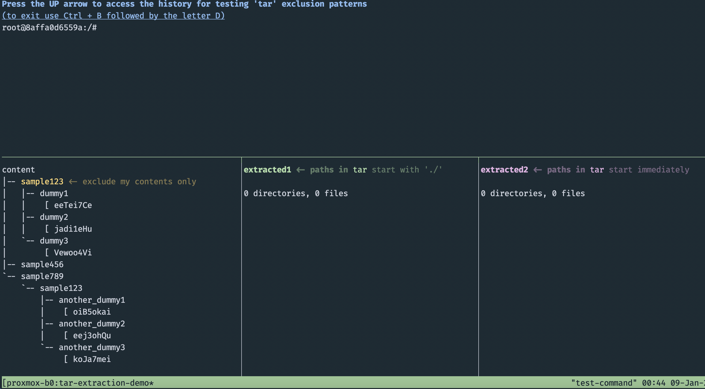

# Proxmox Bug 6040 - Patch Documentation

_This repository contains a functional demo, and a following discussion._

The intention is to demonstrate, and then explain the context for [bug report 6040](https://bugzilla.proxmox.com/show_bug.cgi?id=6040) and the [patch](https://lore.proxmox.com/pve-devel/mailman.80.1736016466.441.pve-devel@lists.proxmox.com/T/#u) linked to it.

## Table of contents

- Instructions for Interactive Demo
- Discussion and Patch Rationale

## Interactive Demo

The purpose of the demo is to demonstrate how exclude patterns work under `tar`.

### Instructions

1.  Clone the repository. I prefer to clone all of my repositories to `$HOME/repos`, which I am assuming below:
    
    ```bash
    cd ~
    git clone https://github.com/diraneyya/bug_proxmox_6040.git tar_extraction_demo
    cd tar_extraction_demo
    ```
  
2.  After cloning the repository, type in the following commands: 
    
    ```bash
    cd ~/repos/tar_extraction_demo
    tar tf file1.tar
    tar tf file2.tar
    ```
  >  [!TIP]
  > The `t` option stands for "Tree", which lists the file paths inside of the archive. The `f` option stands for "File", and allows the user to select the tar archive using its filename.
  
  > [!NOTE]
  > The two files, [file1.tar](./file1.tar) and [file2.tar](./file2.tar) contain the same set of files and directories. Yet, they are different in an important way. Run the two commands above to figure out how.
  
3.  Now is the time to spin up the demo using the [demo.sh](./demo.sh) script:
    
    ```bash
    cd ~/repos/tar_extraction_demo
    # run the script
    ./demo.sh
    ```

4.  The script might take a bit of time to run on the first time it is invoked, so please be patient. It might also offer instructions on how to install missing utilities (such as `tree` or `tmux`), or refuse to run if the `docker` command was not found on the local system.
   
  > [!TIP]
  > Docker is used by the script to mimic the Debian-12 environment used by Proxmox when extracting archives.

  > [!NOTE]
  > Unlike `tree` and `tmux`, the script does not try to offer advice on how to install Docker.
   
5.  After launching the demo, you must see a horizontal pane at the top, and three vertical panes at the bottom. These are for:
    - The archive's original contents in the [content](./content) folder. **(bottom left)**
    - The results of extracting [file1.tar](./file1.tar) to the [extracted1](./extracted1) folder using the `test_tar_extraction` helper function. **(bottom middle)**
    - The results of extracting [file2.tar](./file2.tar) to the [extracted2](./extracted2) folder using the `test_tar_extraction` helper function. **(bottom right)**

    

  > [!TIP]
  > Initially, the bottom middle and bottom right panes, are empty. This will change as you start running the extraction commands at the top pane. Note that with every extraction, the contents of the folders are wiped out to simulate a fresh start. Hence, if the extraction command fails, then both directories will remain empty.

6.  Now let us start by extracting both archives using no exclusion patterns at all:
    
    ```bash
    test_tar_extraction
    ```

  > [!TIP]
  > The `test_tar_extraction` helper will take the arguments you supply to it and channel them to `tar` for the extraction of both archives (i.e. [file1.tar](./file1.tar) and [file2.tar](./file2.tar)).

  > [!WARNING]
  > Can you make sense of what you see after running this command? Are you able to see the full `tar` command being used underneath? was the extraction successful in this case?

7.  Now let us try to supply an empty exclusion pattern, as follows:
    
    ```bash
    test_tar_extraction --exclude
    ```

  > [!WARNING]
  > Can you make sense of what you see running this command? Are you able to see the full `tar` command being used by `test_tar_extraction`? was the extraction successful in this case?

8.  Now, try some more exclude patterns:
    
    ```bash
    test_tar_extraction --exclude *
    test_tar_extraction --exclude sample123      # what happened?
    test_tar_extraction --exclude sample123/*    # is this what we want?
    test_tar_extraction --exclude ./sample123    # what happened?
    test_tar_extraction --exclude ./sample123/*  # is this what we want?
    ```

  > [!NOTE]
  > The goal here is to exclude the contents of the root `sample123` folder in the archive, leaving an empty root directory after the extraction. Note that there is another nested directory with the same name (i.e. `[./]sample789/sample123`), which needs to be extracted as-is.

  > [!TIP]
  > If you are wondering why supplying an exclusion pattern of just `sample123` does not exclude the non-root (i.e. nested) directory, then try using the `--no-anchored` option:
  > ```bash
  > test_tar_extraction --no-anchored --exclude sample123
  > # "tar xf file?.tar -C extracted? --anchored --no-anchored --exclude sample123"
  > # note that the supplied "--no-anchored" cancels the "--anchored" option built
  > # into the `test_tar_extraction` helper function.
  > ```

9.  Finally. Now you are able to take everything you learnt above and apply it to create a `tar` exclusion pattern that successfully excludes the root `sample123` folder in **both archives**:
    
    ```bash
    test_tar_extraction --exclude sample123/* --exclude ./sample123/* # uses --anchored
    # a smarter alternative, which expands to the same
    test_tar_extraction --exclude={,./}sample123/*
    ```

### Cleaning Up

Before moving on to the discussion part of this README file. You can exit the demo using <kbd>Ctrl</kbd>+<kbd>B</kbd>, followed by <kbd>D</kbd>. After that, you can clean the environment using the following clean-up command:

```bash
cd ~/repos/tar_extraction_demo
# run the cleaning script
./demo.sh clean
```

## Discussion

### Current Code

This [relevant line](https://github.com/proxmox/pve-container/blob/85a1397d7254b0d9f042c0558578f4d5488e5446/src/PVE/LXC/Create.pm#L78) of the current codebase excludes the root `dev` folder's  contents when extracting the root filesystem for an LXC container in Proxmox:

```perl
    push @$cmd, '--exclude' , './dev/*';
```

<mark>The only issue here, is that it assumes that the tarball has paths starting with a _dot slash_ (similar to [file1.tar](./file1.tar)), rather than without a _dot slash_ (similar to [file2.tar](./file2.tar)).</mark>

### Inquiry

Below is a table showing different root filesystem images and converters, and assessing their output's compatibility with Linux containers in Proxmox.

The idea here is that anything that resembles a Linux **root-filesystem archive**, deserves an opportunity to be leveraged as a Linux container template —should this be, at all, possible.

| Project    | Archive Path Prefix | Root `dev` Folder? | Before Patch | After Patch |
|------------|---------------------|--------------------|:------------:|:-----------:|
| Ubuntu[^1] | None | <mark>Populated</mark> | :x:                | :white_check_mark: |
| Alpine[^2] | `./` | Empty                  | :white_check_mark: | :white_check_mark: |
| Linux Containers[^3] | `./` | Empty | :white_check_mark: | :white_check_mark: |
| docker2lxc[^4] | `./` | Limited | :white_check_mark: | :white_check_mark: |
| sqfs2tar[^5] | None | <mark>Populated</mark> | :x: | :white_check_mark: |

[^1]: https://cloud-images.ubuntu.com/ (Look files ending with `-root.tar.xz`)
[^2]: https://alpinelinux.org/downloads/ (Look for _Mini Root Filesystems_)
[^3]: https://images.linuxcontainers.org/ (Look files named `rootfs.tar.xz`)
[^4]: Using [`docker2lxc`](https://github.com/diraneyya/docker2lxc) it was possible to convert this 10GB [universal:2](https://hub.docker.com/r/microsoft/devcontainers-universal) Microsoft Docker container to an LXC template, which worked.
[^5]: https://cdimage.debian.org/debian-cd/current-live/amd64. Using a live system ISO, the `sqfs2tar` utility was used to convert the `squashfs` filesystwm image to `tar`, which was then gzipped to create an LXC template.

> [!WARNING]
> This table is a work in progress.

### Rationale for the Patch

> [!TIP]
> This section is improved by ChatGPT.

As virtualization evolved from VMs to containers, Proxmox users increasingly seeked to adapt existing VM workloads for Linux containers. A critical step in this process involves obtaining a root filesystem archive that encapsulates the base operating system. Such archives, however, vary depending on their origins:

1.  **Legacy Archives:** Derived from VM-oriented systems or live system images (e.g., squashfs archives).

    - Tend to include fully populated root folders (e.g. `/dev`).
    - Often omit a leading `./` prefix in the paths within the archive.

2.  **Modern Archives:** Designed with containerization in mind or for specific containerization technologies (e.g., Docker).

    - Typically contain minimal or empty root folders, including an empty or a minimally populated `/dev`.
    - Consistently include a `./` prefix in the paths within the archive.

These differences create challenges in Linux container creation, particularly with populated `/dev` directories and paths without a _dot slash_. Linux containers manage their own root `/dev` folder, and hence, a fully populated `/dev` in the archive's root leads to failure in container creation.

### The Current Situation

The existing Proxmox codebase addresses this by excluding the `/dev` root directory during archive extraction. However, the current exclusion pattern (`--exclude ./dev/*`) assumes archive paths that begin with _dot slash_ `./`. While this works for modern archives (which, generally speaking, do not have fully populated root folders), it is ineffective for legacy archives lacking the _dot slash_ `./` path prefix. Consequently, users attempting to repurpose such archives must manually repackage them —a labor-intensive and unnecessary process.

### The Proposed Modification

The proposed edit is rather simple, which is to change the exclusion pattern from `./dev/*` to `dev/*`, to accommodate the legacy archives in which this failure is most likely to occur.

Alternatively, it is possible (and cheap) to accommodate **both** archive types, by using two exclusion patterns (`--exclude={,./}dev/*`).

This approach eliminates the need for repackaging and ensures compatibility with a broader range of root filesystem archives.

### The Patch

https://lore.proxmox.com/pve-devel/mailman.80.1736016466.441.pve-devel@lists.proxmox.com/T/#u
